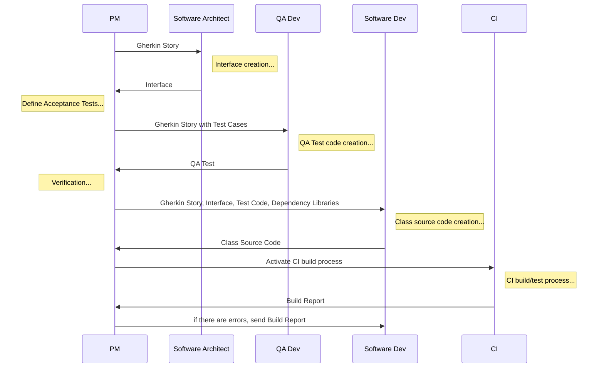

```mermaid
sequenceDiagram
    participant B as PM    
    participant A as Software Architect
    participant C as QA Dev
    participant D as Software Dev
    participant E as CI
    B->> A: Gherkin Story 
    Note right of A: Interface creation... 
    A->> B: Interface
    Note left of B: Define Acceptance Tests... 
    B->> C: Gherkin Story with Test Cases
    Note right of C: QA Test code creation... 
    C->> B: QA Test
    Note left of B: Verification...
    B->> D: Gherkin Story, Interface, Test Code, Dependency Libraries
    Note right of D: Class source code creation... 
    D->> B: Class Source Code
    B->> E: Activate CI build process
    Note right of E: CI build/test process... 
    E->> B: Build Report 
    B->> D: if there are errors, send Build Report
```