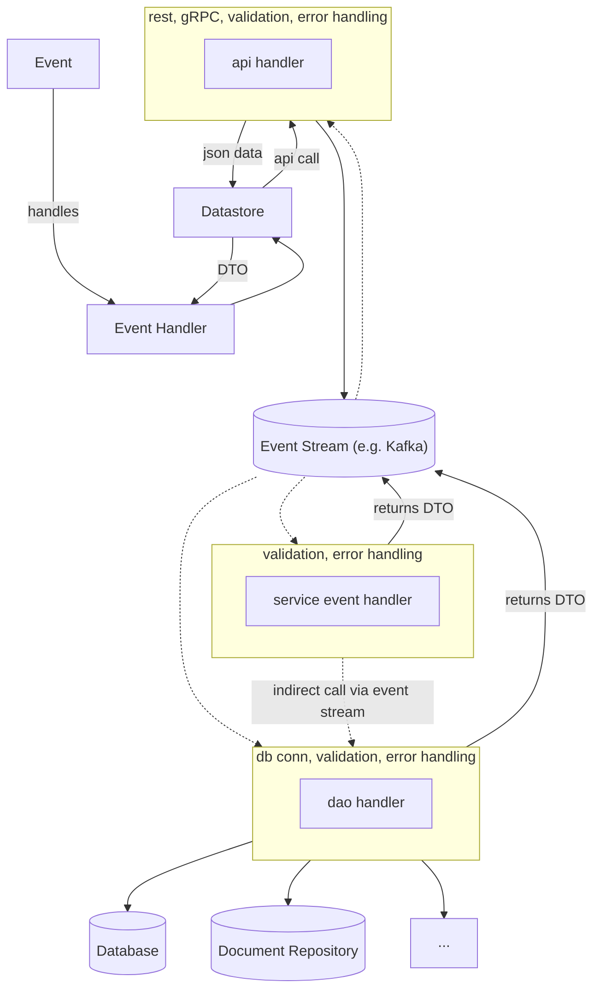

```mermaid
flowchart TB
    subgraph SEH[validation, error handling]
        H1[service event handler]
    end
    subgraph DAO[db conn, validation, error handling]
        H2[dao handler]
    end
    subgraph API[rest, gRPC, validation, error handling]
        H3[api handler]
    end
    A[Event] --->|handles| B[Event Handler]
    B --> C[Datastore]
    C --> |DTO|B
    C -->|api call| API
    API -->|json data| C
    API ----> K[("Event Stream (e.g. Kafka)")]
    K -.-> API
    K -.->SEH
    SEH -->|returns DTO|K
    K -.-> DAO
    DAO --> G[(Database)]
    DAO --> H[(Document Repository)]
    DAO --> I[...]
    DAO-->|returns DTO|K    
    SEH -.->|indirect call via event stream| DAO
```