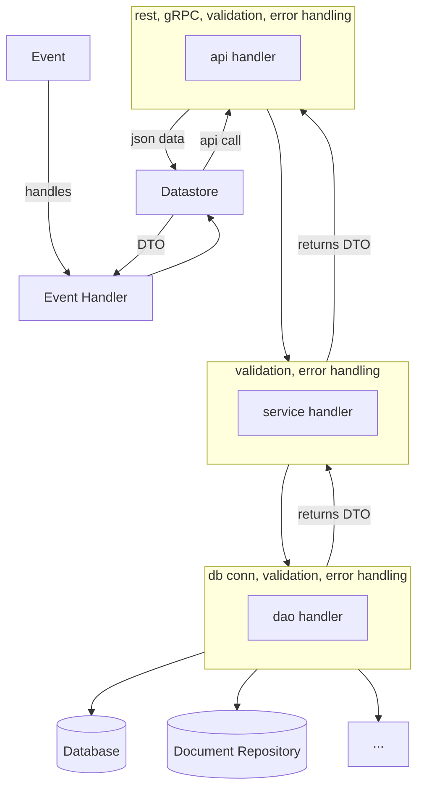

```mermaid
flowchart TB
    subgraph SRH[validation, error handling]
        H1[service handler]
    end
    subgraph DAO[db conn, validation, error handling]
        H2[dao handler]
    end
    subgraph API[rest, gRPC, validation, error handling]
        H3[api handler]
    end
    A[Event] --->|handles| B[Event Handler]
    B --> C[Datastore]
    C --> |DTO|B
    C -->|api call| API
    API -->|json data| C
    API ----> SRH
    SRH ---> DAO
    SRH -->|returns DTO|API
    DAO --> G[(Database)]
    DAO --> H[(Document Repository)]
    DAO --> I[...]
    DAO-->|returns DTO|SRH    
```