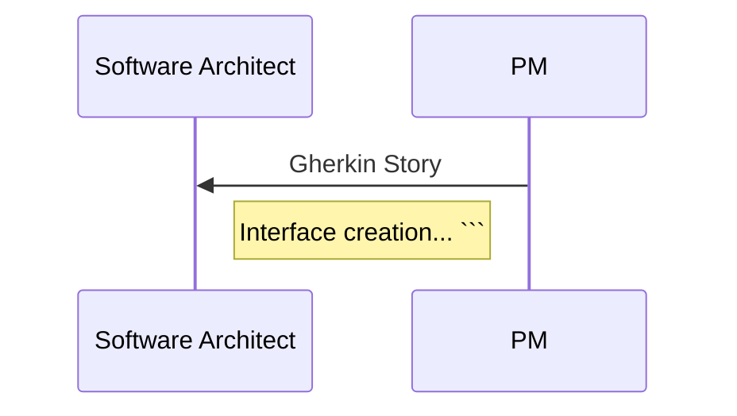

### Mermaid CLI
#### Install
```bash
$ docker pull minlag/mermaid-cli
```

#### Convert to SVG

```bash
$ docker run --rm -v ./:/data minlag/mermaid-cli -i diagrams/input.md -t default -b transparent -o images/output.svg
```

or

```bash
$ docker run --rm -u `id -u`:`id -g` -v ./:/data minlag/mermaid-cli -i diagrams/input.md -t default -b transparent -o images/output.svg
```


File `input.md` contains markdown text with Mermaid diagram

```
